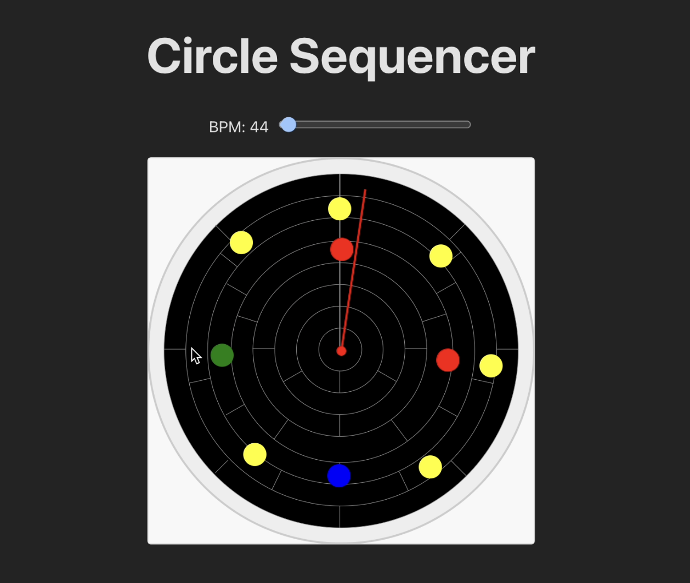

# Circular Rhythm Sequencer

The Circular Rhythm Sequencer presents a different perspective on time and beat patterns. Instead of a linear timeline, you arrange sounds along a circle. As a pointer rotates around this circle at a set tempo (BPM), it triggers any placed notes it passes. This approach helps visualize and experiment with rhythms in a more intuitive, looping structure.

By adjusting the BPM and rearranging notes, you can explore rhythm patterns:
- **Add Items:** Use simple clicks to add color-coded circle, each representing a beat, positioned anywhere within the circle.
- **Edit Items:** Drag the circle items to adjust their position or select them to change categories or delete.

Below is a screenshot showcasing the interface and how notes are arranged in a radial fashion:

Try it out to see how this cyclical representation of time can inspire fresh rhythmic ideas, whether you’re a musician, educator, or just curious about new ways to visualize beats.
